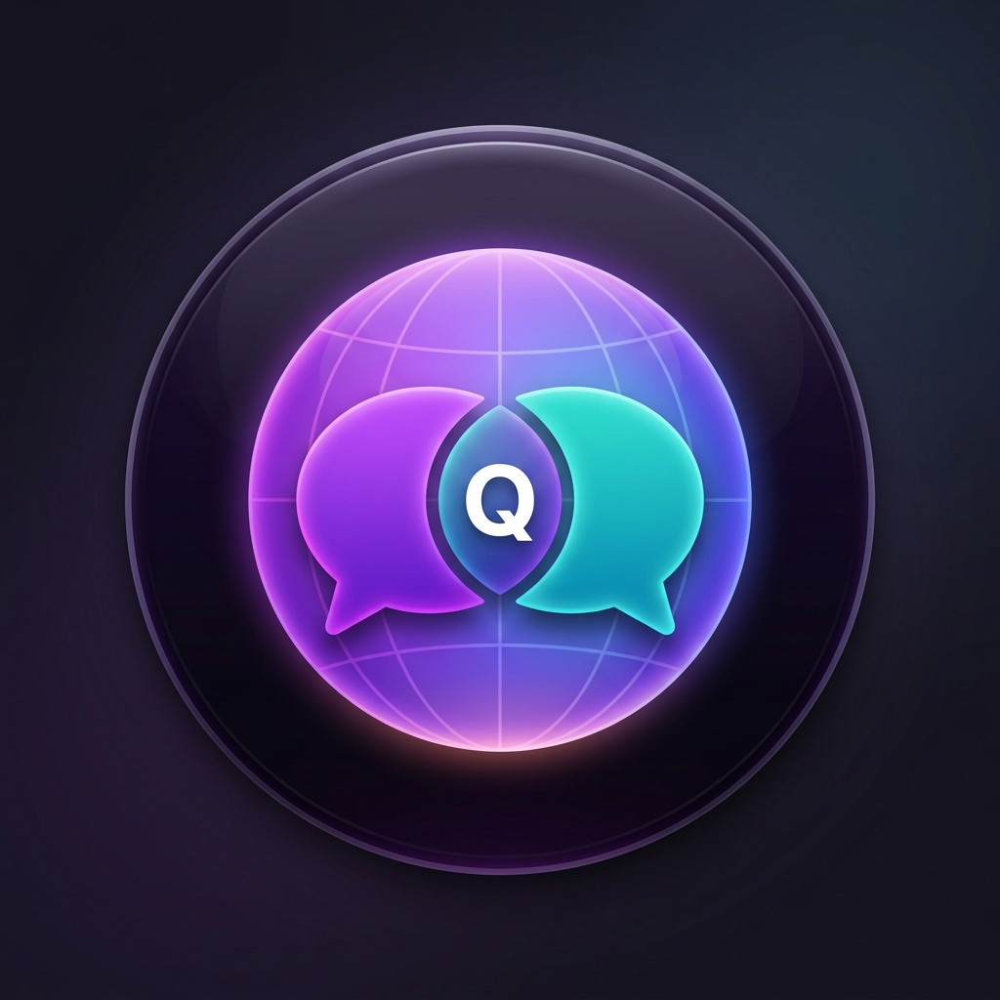
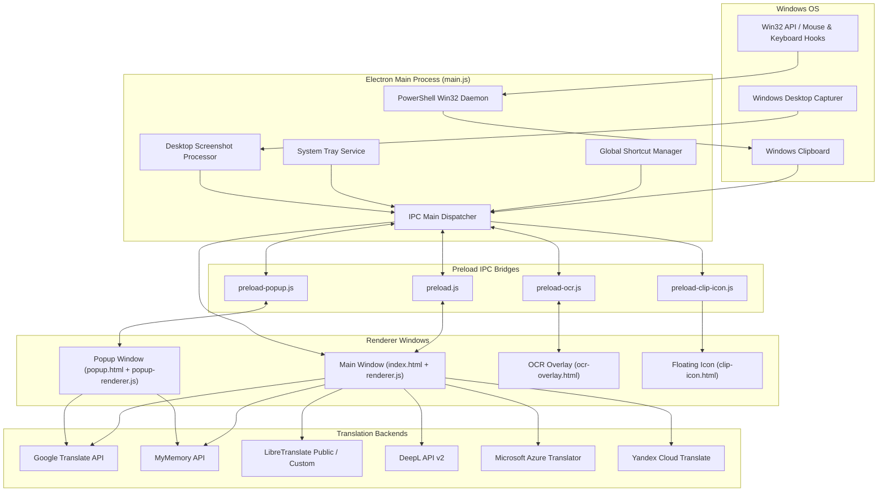

<div align="center">



# QTranslate

### *Modern, Ultra-Fast, and Intelligent Desktop Translator for Windows*
### *مترجم سطح مكتب فوري وذكي لنظام ويندوز*

[](.)
[-0078D6?style=for-the-badge&logo=windows&logoColor=white)](.)
[](LICENSE)
[](https://www.electronjs.org/)
[](https://nodejs.org/)
[](https://tesseract.projectnaptha.com/)

<p align="center">
  <a href="#-english-version"><b>English Documentation</b></a> •
  <a href="#-النسخة-العربية"><b>الوثائق باللغة العربية</b></a>
</p>

---

</div>

<a name="english-version"></a>
# 🇬🇧 English Version

[Key Features](#-key-features) •
[Architecture](#-system-architecture) •
[Engines & Languages](#-translation-engines--supported-languages) •
[Global Hotkeys](#-global-hotkeys) •
[Installation & Usage](#-installation--getting-started) •
[Building from Source](#-building-and-packaging) •
[Project Structure](#-project-structure) •
[License](#-license)

---

## 🌟 Overview

**QTranslate** is an open-source, next-generation desktop translation software built with **Electron**. It runs seamlessly in the background and enables instant text translation across all Windows applications (browsers, Word, PDFs, Discord, games) without opening a browser tab.

### Highlights:
- ⚡ **Instant Drag-to-Translate**: Automatically detects highlighted text via native Win32 hooks and displays a floating action bubble (`🌐`).
- 🎯 **Multi-Engine Intelligence**: Connects to 6 translation providers (Google, MyMemory, LibreTranslate, DeepL, Microsoft Azure, Yandex) with automatic failover redundancy.
- 📸 **Screen OCR Snapping**: Optical Character Recognition powered by **Tesseract.js v5** to extract and translate unselectable text from images, videos, and application interfaces.
- 🎨 **Modern Aesthetics**: Frameless glassmorphic dark interface with animated background gradients and full RTL/LTR bidirectional support.
- 🔊 **Text-to-Speech (TTS)**: Built-in voice synthesis for 5 major world languages.

---

## ✨ Key Features

### 1. 🌐 Real-Time Multi-Engine Translation
- **Live Debounced Typing**: Automatic translation as you type with intelligent 1.2s debouncing.
- **Failover Redundancy**: If a primary translation provider experiences rate limits or network issues, QTranslate gracefully switches to high-availability fallback engines (Google & MyMemory) with user toast notifications.
- **Auto Source Language Detection**: Heuristic script and charset recognition for rapid detection.
- **One-Click Language Swap**: Seamlessly flips source and target texts and corresponding layouts.

### 2. 🖱️ Smart Drag-Selection & Floating Quick-Action
- Powered by a low-overhead background PowerShell daemon utilizing native Win32 API (`GetAsyncKeyState`, `keybd_event`, `GetCursorPos`).
- Intelligently triggers only when user selects real text (drag threshold > 25px) outside QTranslate windows.
- Automatically displays a floating action bubble (`🌐`) right next to your mouse cursor.
- Click the bubble to immediately open the translation workspace with the copied text populated and translated.

### 3. 🔍 Screen OCR & Region Capture
- Fullscreen transparent overlay allows drawing bounding boxes over any portion of any monitor.
- Integrated **Tesseract.js v5** engine supporting simultaneous multi-language recognition (`ara`, `eng`, `chi_sim`, `fra`, `spa`).
- **Triple Action Bar**:
  - 🌐 **Extract & Translate**: Processes image with OCR and streams extracted text straight into the translation window.
  - 📋 **Copy to Clipboard**: Copies the cropped screenshot directly to the system clipboard.
  - 💾 **Save Image**: Exports the region as a high-resolution PNG file.

### 4. 🪟 Quick Popup Translator
- Lightweight, frameless overlay (`popup.html`) that appears right beside your cursor.
- Shows instant translation with an auto-dismiss visual countdown progress bar.
- Includes a **Pin (📌)** toggle to keep the window persistent for reference.
- Direct switch to view the original source text or open the full application.

### 5. ⌨️ Fully Customizable Global Hotkeys
- Global hotkey listener registering system-wide shortcuts even when the app is minimized.
- Visual hotkey recorder modal with real-time keypress capture and modifier-key validation.
- Built-in conflict prevention and persistent storage in user application profile.

### 6. 🔊 Text-to-Speech (TTS)
- Integrated Web Speech API (`SpeechSynthesis`) with localized voice synthesis for Arabic (`ar-SA`), English (`en-US`), Chinese (`zh-CN`), French (`fr-FR`), and Spanish (`es-ES`).
- Dedicated playback buttons for both source and translated outputs.

### 7. 🕒 History Manager
- Automatically retains the last 50 translations with language badges and timestamps.
- Single-click to restore previous translations into the workspace.
- Clear history at any time with one click.

### 8. 🛡️ System Tray Daemon
- Closes to tray silently for 24/7 background availability.
- Quick tray context menu for rapid OCR capture, clipboard translation, settings, and full quit.

---

## 🏛️ System Architecture



---

## 🌐 Translation Engines & Supported Languages

### Supported Translation Engines

| Provider | Access Mode | API Key Required | Speed / Reliability | Description |
| :--- | :---: | :---: | :---: | :--- |
| **Google Translate** | Free | ❌ No | ⚡⚡⚡ High | Default ultra-fast engine with broad vocabulary. |
| **MyMemory** | Free | ❌ No | ⚡⚡ High | Massive translation memory network; ideal fallback. |
| **LibreTranslate** | Open Source | ❌ No | ⚡⚡ Medium | Decentralized privacy-focused translation servers. |
| **DeepL** | Official API | 🔑 Yes | ⚡⚡⚡ Excellent | Industry-leading natural neural translations. |
| **Microsoft Translator** | Azure API | 🔑 Yes | ⚡⚡⚡ High | Enterprise-grade Microsoft Cognitive Services. |
| **Yandex Translate** | Official API | 🔑 Yes | ⚡⚡ High | Robust multilingual neural translation engine. |

### Supported Language Matrix

| Language | Code | Flag | Direction | OCR Support | TTS Support |
| :--- | :---: | :---: | :---: | :---: | :---: |
| **Auto Detect** | `auto` | 🔍 | Dynamic | — | Dynamic |
| **Arabic** | `ar` | 🇸🇦 | RTL | ✅ `ara` | ✅ `ar-SA` |
| **English** | `en` | 🇺🇸 | LTR | ✅ `eng` | ✅ `en-US` |
| **Chinese Simplified** | `zh` | 🇨🇳 | LTR | ✅ `chi_sim` | ✅ `zh-CN` |
| **French** | `fr` | 🇫🇷 | LTR | ✅ `fra` | ✅ `fr-FR` |
| **Spanish** | `es` | 🇪🇸 | LTR | ✅ `spa` | ✅ `es-ES` |

---

## ⌨️ Global Hotkeys

All hotkeys are active system-wide and can be customized in **Settings (⚙️)**:

| Hotkey | Default Combination | Action Description |
| :--- | :--- | :--- |
| **Quick Popup Translation** | `Ctrl + Q` | Auto-copies selected text and opens floating cursor popup. |
| **Clipboard Translation** | `Ctrl + Alt + Q` | Opens main window and translates current clipboard contents. |
| **Toggle Window Visibility** | `Ctrl + Alt + T` | Shows / hides the main QTranslate window. |
| **Screen OCR Selector** | `Ctrl + Shift + O` | Launches fullscreen snipping overlay to capture and translate. |
| **Instant Translation (App)** | `Ctrl + Enter` | Triggers immediate translation in main workspace textarea. |

---

## 🚀 Installation & Getting Started

### Option A: Pre-built Binaries (End-Users)
1. Download from the [Releases](https://github.com/your-username/QTranslate/releases) page:
   - **`QTranslate Setup 2.0.0.exe`**: Full installer with Desktop and Start Menu shortcuts.
   - **`QTranslate-Portable.exe`**: Standalone executable (no installation required).
2. Run the application.

### Option B: Running from Source (Developers)
```bash
# Clone the repository
git clone https://github.com/your-username/QTranslate.git
cd QTranslate

# Install dependencies
npm install

# Start development mode
npm start

# Start with DevTools
npm run dev
```

---

## 📦 Building and Packaging

```powershell
# Build NSIS Installer + Portable (PowerShell)
$env:CSC_IDENTITY_AUTO_DISCOVERY="false"
npm run build

# Build unpacked portable package
npm run package
```

Output files will be generated in `dist/`:
- `dist/QTranslate Setup 2.0.0.exe`
- `dist/QTranslate-Portable.exe`

---

<br />

---

<a name="النسخة-العربية"></a>
# 🇸🇦 النسخة العربية (Arabic Version)

[نظرة عامة](#-نظرة-عامة-1) •
[المميزات الرئيسية](#-المميزات-الرئيسية) •
[المعمارية التقنية](#-المعمارية-التقنية) •
[محركات الترجمة واللغات](#-محركات-الترجمة-واللغات-المدعومة) •
[الاختصارات](#-اختصارات-لوحة-المفاتيح) •
[التثبيت والتشغيل](#-التثبيت-والتشغيل-1) •
[بناء التطبيق](#-بناء-التطبيق-والتحزيم) •
[هيكل المشروع](#-هيكل-المشروع-1) •
[الترخيص](#-الترخيص)

---

## 🌐 نظرة عامة

**QTranslate** هو تطبيق ترجمة فوري متطور لسطح المكتب مبني باستخدام إطار عمل **Electron**. يعمل التطبيق في الخلفية بتناسق تام مع نظام Windows ليوفر تجربة ترجمة فورية للنصوص في أي تطبيق (المتصفحات، محررات النصوص، ملفات PDF، الألعاب) دون الحاجة لفتح المتصفح أو مقاطعة عملك.

### أبرز النقاط:
- ⚡ **ترجمة فورية عند تحديد النص**: التعرف التلقائي على تحديد النصوص عبر Win32 API وإظهار أيقونة عائمة بجوار المؤشر (`🌐`).
- 🎯 **دعم 6 محركات ترجمة**: التكامل مع Google و MyMemory و LibreTranslate و DeepL و Microsoft Azure و Yandex مع دعم التبديل التلقائي الاحتياطي (Failover) عند انقطاع أي خدمة.
- 📸 **استخراج النص من الشاشة (OCR)**: أداة تحديد وقراءة النصوص من أي منطقة بالشاشة باستخدام **Tesseract.js v5** للتعرف على النصوص العربية والإنجليزية والصينية والفرنسية والإسبانية.
- 🎨 **واجهة عصرية بنمط Glassmorphism**: تصميم داكن شفاف أنيق، تأثيرات حركية تفاعلية، ودعم كامل للاتجاهين (RTL و LTR).
- 🔊 **نطق صوتي (Text-to-Speech)**: قراءة آلية دقيقة للنصوص الأصلية والمترجمة بلكنات محلية.

---

## ✨ المميزات الرئيسية

### 1. 🌐 الترجمة الفورية الذكية
- **الترجمة أثناء الكتابة**: ترجمة آلية سلسة مع Debounce ذكي (1.2 ثانية) لمنع استهلاك الشبكة بدون داعٍ.
- **محركات احتياطية تلقائية (Auto-Failover)**: في حال حدوث خطأ أو انتهاء الحصة في المحرك المختار، يقوم التطبيق تلقائياً بالتحويل لمحركات بديلة مع تنبيه المستخدم.
- **كشف تلقائي فوري للغة**: خوارزمية ذكية للتعرف على لغة النص المصدر وتطبيق الاتجاه المناسب (يمين/يسار).
- **تبديل اللغات بضغطة زر**: عكس لغة المصدر والهدف وتحديث الواجهة والاتجاهات فورياً.

### 2. 🖱️ رصد تحديد النص وأيقونة الـ Clipboard العائمة
- تعمل عبر سكربت PowerShell خفيف في الخلفية يستخدم Win32 API (`GetAsyncKeyState`, `keybd_event`, `GetCursorPos`).
- يتفادى التحديدات العرضية (يشترط سحب الماوس لمسافة أكبر من 25 بكسل خارج نوافذ التطبيق).
- إظهار أيقونة عائمة (`🌐`) بجانب مؤشر الماوس تلقائياً.
- بمجرد الضغط على الأيقونة يفتح التطبيق وتتم ترجمة النص المحدد فورياً.

### 3. 🔍 استخراج النص من الشاشة (OCR)
- نافذة شفافة تغطي الشاشة بالكامل لرسم مستطيل التحديد على أي منطقة.
- محرك **Tesseract.js v5** يدعم 5 لغات متزامنة (`ara`, `eng`, `chi_sim`, `fra`, `spa`).
- **خيارات سريعة بعد التحديد**:
  - 🌐 **استخراج وترجمة**: يقرأ النص وينقله فورياً لنافذة الترجمة.
  - 📋 **نسخ كصورة**: ينسخ لقطة الشاشة للحافظة.
  - 💾 **حفظ كـ PNG**: يحفظ الصورة المحددة بجودة عالية على جهازك.

### 4. 🪟 نافذة الـ Popup السريعة
- نافذة منبثقة خفيفة وشفافة تظهر بجانب المؤشر عند الضغط على `Ctrl + Q`.
- تعرض الترجمة مع شريط عد تنازلي يغلق النافذة تلقائياً.
- إمكانية تثبيت النافذة (**Pin 📌**) لمنع إغلاقها عند القراءة.

### 5. ⌨️ اختصارات لوحة المفاتيح القابلة للتخصيص بالكامل
- تسجيل الاختصارات في نافذة تفاعلية تسجل المفاتيح المضغوطة فعلياً وتتحقق من صحتها.
- تخزين الاختصارات محلياً واستعادتها بسهولة بزر استعادة الافتراضي.

### 6. 🔊 النطق الصوتي (TTS)
- تشغيل صوتي عالي الدقة للنص الأصلي والمترجم باللغات: العربية (`ar-SA`)، الإنجليزية (`en-US`)، الصينية (`zh-CN`)، الفرنسية (`fr-FR`)، والإسبانية (`es-ES`).

### 7. 🕒 سجل الترجمات (History)
- حفظ آخر 50 عملية ترجمة مع أعلام اللغات والتوقيت.
- استعادة أي ترجمة سابقة بضغطة واحدة، مع إمكانية مسح السجل كاملاً.

### 8. 🛡️ التواجد في شريط المهام (System Tray)
- الإغلاق للـ Tray ليعمل التطبيق بخفة في الخلفية 24/7 دون إشغال شريط المهام.
- قائمة منبثقة سريعة لتفعيل الـ OCR، ترجمة الحافظة، فتح الإعدادات، أو الإغلاق النهائي.

---

## 🏛️ المعمارية التقنية

```
┌────────────────────────────────────────────────────────┐
│               العملية الرئيسية Main Process            │
│  - إدارة النوافذ و دورة حياة التطبيق                   │
│  - تسجيل الاختصارات العالمية Global Shortcuts          │
│  - مراقبة تحديد الماوس عبر Win32 API في الخلفية        │
│  - التقاط لقطات الشاشة للـ OCR (desktopCapturer)       │
│  - إدارة قائمة الـ System Tray والـ IPC Handlers       │
└───────────────────────────┬────────────────────────────┘
                            │ قنوات ContextBridge (IPC)
     ┌──────────────────────┼──────────────────────┐
     │                      │                      │
┌────▼────┐            ┌────▼────┐            ┌────▼─────┐
│ النافذة │            │ نافذة الـ│            │ نافذة الـ│
│الرئيسية │            │ Popup   │            │ OCR      │
│renderer │            │popup-ren│            │ocr-over  │
│  .js    │            │derer.js │            │lay.html  │
└─────────┘            └─────────┘            └──────────┘
```

---

## 🌐 محركات الترجمة واللغات المدعومة

### مقارنة المحركات

| المحرك | نوع الوصول | يتطلب API Key | السرعة والموثوقية | الوصف |
| :--- | :---: | :---: | :---: | :--- |
| **Google Translate** | مجاني | ❌ لا | ⚡⚡⚡ عالية جداً | المحرك الافتراضي فائق السرعة وبمفردات لغوية هائلة. |
| **MyMemory** | مجاني | ❌ لا | ⚡⚡ عالية | شبكة ذاكرة ترجمة ضخمة تُستخدم كمحرك احتياطي ممتاز. |
| **LibreTranslate** | مفتوح المصدر | ❌ لا | ⚡⚡ متوسطة | خوادم ترجمة مفتوحة المصدر تحافظ على الخصوصية. |
| **DeepL** | API رسمي | 🔑 نعم | ⚡⚡⚡ فائقة | أفضل ترجمة عصبية سياقية دقيقة للمصطلحات. |
| **Microsoft Translator** | Azure API | 🔑 نعم | ⚡⚡⚡ عالية | خدمات الذكاء الاصطناعي السحابية من مايكروسوفت. |
| **Yandex Translate** | API رسمي | 🔑 نعم | ⚡⚡ عالية | ترجمة عصبية متعددة اللغات دقيقة. |

### مصفوفة اللغات المدعومة

| اللغة | الرمز | العلم | الاتجاه | دعم الـ OCR | دعم النطق الصوتي |
| :--- | :---: | :---: | :---: | :---: | :---: |
| **كشف تلقائي** | `auto` | 🔍 | ديناميكي | — | ديناميكي |
| **العربية** | `ar` | 🇸🇦 | من اليمين لليسار (RTL) | ✅ `ara` | ✅ `ar-SA` |
| **English** | `en` | 🇺🇸 | من اليسار لليمين (LTR) | ✅ `eng` | ✅ `en-US` |
| **中文 (الصينية)** | `zh` | 🇨🇳 | من اليسار لليمين (LTR) | ✅ `chi_sim` | ✅ `zh-CN` |
| **Français (الفرنسية)** | `fr` | 🇫🇷 | من اليسار لليمين (LTR) | ✅ `fra` | ✅ `fr-FR` |
| **Español (الإسبانية)** | `es` | 🇪🇸 | من اليسار لليمين (LTR) | ✅ `spa` | ✅ `es-ES` |

---

## ⌨️ اختصارات لوحة المفاتيح

تعمل الاختصارات عالمياً على مستوى النظام بالكامل، ويمكن تعديلها من **الإعدادات (⚙️)**:

| الاختصار الافتراضي | الوظيفة |
| :--- | :--- |
| `Ctrl + Q` | نسخ النص المحدد وإظهار الترجمة في نافذة الـ Popup السريعة بجوار المؤشر. |
| `Ctrl + Alt + Q` | فتح النافذة الرئيسية وترجمة محتوى الحافظة (Clipboard) فورياً. |
| `Ctrl + Alt + T` | إظهار / إخفاء النافذة الرئيسية للتطبيق. |
| `Ctrl + Shift + O` | تشغيل أداة التحديد وقراءة النصوص من الشاشة (OCR). |
| `Ctrl + Enter` | ترجمة فورية أثناء الكتابة داخل النافذة الرئيسية. |

---

## 💿 التثبيت والتشغيل

### الخيار 1: للمستخدم العادي (الملفات الجاهزة)
1. انتقل لصفحة [Releases](https://github.com/your-username/QTranslate/releases).
2. حمّل الملف المناسب لك:
   - **`QTranslate Setup 2.0.0.exe`**: مثبت تلقائي ينشئ اختصارات على سطح المكتب وقائمة ابدأ.
   - **`QTranslate-Portable.exe`**: نسخة محمولة تعمل فورياً بدون تثبيت.
3. شغّل البرنامج واستمتع بالترجمة الفورية!

### الخيار 2: للمطورين (التشغيل من الكود المصدري)
```bash
# 1. استنساخ المستودع
git clone https://github.com/your-username/QTranslate.git
cd QTranslate

# 2. تثبيت الحزم والمتطلبات
npm install

# 3. التشغيل في وضع التطوير
npm start

# أو التشغيل مع أدوات المطورين DevTools
npm run dev
```

---

## 📦 بناء التطبيق والتحزيم

```powershell
# بناء مثبت NSIS + نسخة Portable (في PowerShell)
$env:CSC_IDENTITY_AUTO_DISCOVERY="false"
npm run build

# أو بناء مجلد Portable مفكوك
npm run package
```

الملفات الناتجة ستكون داخل مجلد `dist/`:
- `dist/QTranslate Setup 2.0.0.exe` (ملف التثبيت)
- `dist/QTranslate-Portable.exe` (النسخة المحمولة)

---

## 📁 هيكل المشروع

```
QTranslate/
├── 📁 assets/                     # الأيقونات وملفات المكتبات المحلية
│   ├── icon.ico                   # أيقونة التطبيق والمثبت لويندوز
│   ├── icon.png                   # شعار التطبيق بدقة عالية
│   ├── tesseract.min.js           # مكتبة Tesseract.js للـ OCR
│   └── tray-icon.png              # أيقونة شريط المهام
│
├── 📁 src/                        # واجهات المستخدم وملفات التنسيق والتحكم
│   ├── clip-icon.html             # واجهة الأيقونة العائمة
│   ├── index.html                 # واجهة النافذة الرئيسية
│   ├── ocr-overlay.html           # واجهة أداة تحديد الشاشة للـ OCR
│   ├── popup.html                 # واجهة نافذة الترجمة السريعة
│   ├── popup.css                  # تنسيقات نافذة الـ Popup
│   ├── popup-renderer.js          # منطق ومعالجة الـ Popup
│   ├── renderer.js                # المنطق الرئيسي (APIs, OCR, TTS, Hotkeys, State)
│   └── styles.css                 # التنسيقات العامة وأنماط Glassmorphism
│
├── 📄 main.js                     # العملية الرئيسية في Electron ونظام الـ Win32
├── 📄 preload.js                  # جسر الأمان IPC للنافذة الرئيسية
├── 📄 preload-clip-icon.js        # جسر الأمان للأيقونة العائمة
├── 📄 preload-ocr.js              # جسر الأمان لأداة الـ OCR
├── 📄 preload-popup.js            # جسر الأمان لنافذة الـ Popup
│
├── 📄 package.json                # إعدادات المشروع وحزم npm
├── 📄 package-lock.json           # شجرة الاعتماديات المثبتة
├── 📄 .gitignore                  # الملفات المستثناة من Git
└── 📄 README.md                   # التوثيق الشامل ثنائي اللغة
```

---

## ❓ الأسئلة الشائعة وحلول المشاكل

<details>
<summary><b>1. الأيقونة العائمة لا تظهر عند تحديد النص.</b></summary>
<br>
تأكد من تفعيل PowerShell في نظامك. تتطلب ميزة مراقبة التحديد سحب الماوس لمسافة تتجاوز 25 بكسل لتمييز التحديد الفعلي عن الضغطات العادية. وتأكد من أن مضاد الفيروسات لا يعترض عمل PowerShell في الخلفية.
</details>

<details>
<summary><b>2. ما مدى دقة استخراج النص عبر OCR؟</b></summary>
<br>
تعتمد الدقة على وضوح الصورة وحجم الخط. يستخدم التطبيق نموذج Tesseract v5 متعدد اللغات. للحصول على أفضل دقة، اختر منطقة ذات تباين جيد وخلفية واضحة.
</details>

<details>
<summary><b>3. أحد الاختصارات لا يستجيب.</b></summary>
<br>
إذا فشل تسجيل اختصار، فهذا يعني أنه محجوز من قبل النظام أو تطبيق آخر (مثل Discord أو بطاقة الشاشة). ادخل إلى <b>الإعدادات (⚙️) ➔ إعدادات الاختصارات</b> وقم بتعيين اختصار بديل متاح.
</details>

---

## 📄 الترخيص

المشروع مرخص تحت رخصة **MIT**. يمكنك استخدامه وتطويره بحرية.

---

<div align="center">

صُنع بـ ❤️ باستخدام **Electron** و **JavaScript** و **Tesseract.js**

⭐ **إذا أعجبك المشروع، لا تنسَ وضع نجمة على مستودع GitHub!**

</div>
